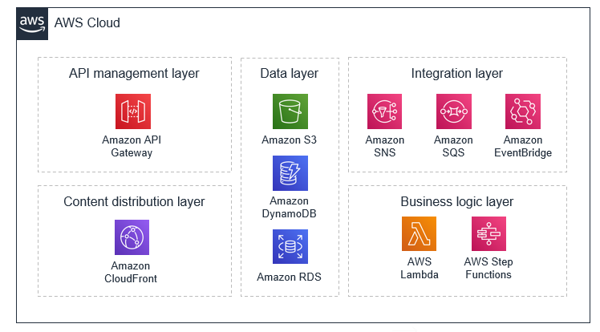

## Overview

The main purpose of Lambda functions is to process events.
 
 Three key components: 
  - event producers
  - event routers
    There are two main types of routers used in event-driven architectures: event buses and event topics. Amazon EventBridge to build event buses and Amazon Simple Notification Service (SNS) to build event topics.
  - event consumers - AWS Lambda and the likes 

Producer services and consumer services are decoupled, which allows them to be **scaled, updated, and deployed independently**.

 

## AWS Services and EDA 
 [[aws-certs/aws services]]

## Trade-offs
  - **variable latency**: Workloads that require consistent low-latency performance, such as high-frequency trading applications in banks or submillisecond robotics automation in warehouses, are not good candidates for event-driven architecture. OTOH, EDA offers high availability. 
  
  Event-driven architectures communicate across different systems using networks, which introduce variable latency. For workloads that require very low latency, such as real-time trading systems, this design may not be the best choice. However, for highly scalable and available workloads, or those with unpredictable traffic patterns, event-driven architectures can provide an effective way to meet these demands.
  
  - **eventual consistency**,
  - handling **asynchronous return values**: Dead Letter Queues. . Async eventual consistency via - Polling, web sockets
  - **Debugging across services and functions**: robust logging, every event has a transaction identifier and  automate the parsing and analysis of logs by using a debugging and monitoring service like AWS X-Ray

This is my note for studying AWS Certifications.