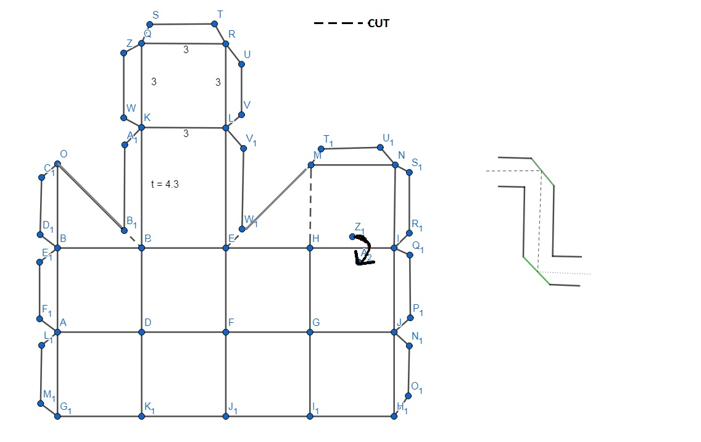

This is about how I analyzed
[this bug](https://github.com/mitmproxy/mitmproxy/issues/2647) in `mitmproxy`
and learnt something new.

Normally, python programs can be debugged with the `pdb.set_trace`. But this
time, since `mitmproxy` uses a window based UI, the attempts to debug crumbled
up the UI and the keystrokes were still being recorded by the UI loop.

Then a quick search gave way for the remote debugger in Python, and these two
lines of codes did the trick for me:

```
	from remote_pdb import RemotePdb
	remote_debugger = RemotePdb('127.0.0.1', 4444)
	.....
	remote_debugger.set_trace
```

Then, on a seperate window, trigger telnet to listen on the port `4444`. Voila,
a clean, non-cluttered debugging environment for you to explore.



Here, you can see the entire process setup on my machine. This enabled me to
have a detailed look at the bug.
