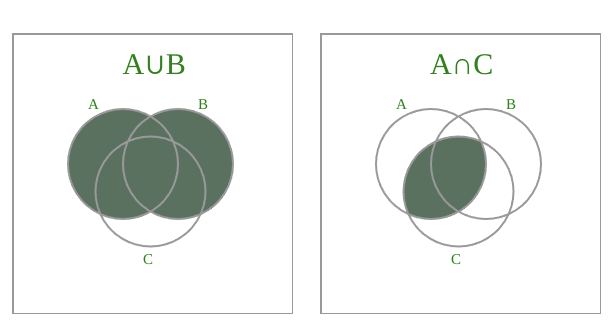

Today something struck me to attempt writing a venn diagram generator. The
candidates were

- d3
- canvas

Lets say we want to generate the diagram for `A∩B`. Pseudocode wise, we can
break it up like this:

- Draw two circles A and B
- Somehow arrive at the intersecting area and color it differently.
  - Option 1: do path arithmetic and compute intersections.
  - Option 2: Using circle equations, check if a given point is within both
    the circles and then paint the pixels individually

Though the above option #2 might seem easy enough to give it a try, we also have
to consider more complex cases for Set expressions like `A∩(B∩C)`. For
expressions like this, the drawing algorithm needs to be a seperate strategy,
and will not be scalable across all expressions.

With the initial thoughts, I realized that there is no easy route to this.
Something needs to be done with Canvas. I also experimented with
[globalcompositeoperation](https://developer.mozilla.org/en-US/docs/Web/API/Canvas_API/Tutorial/Compositing#globalcompositeoperation)
where it was easy to generate the intersection, but stroke lines were all lost.
(since the composite operation is global across the Canvas). Attempts to use the
clip path was also futile. More digging up the internet

## Lateral thinking

I then happened to read the Wikipedia article about Venn Diagram, particularly,
[this section](https://en.wikipedia.org/wiki/Venn_diagram). See the `Related
concepts` section.


So if we are able to identify the separate intersections individually, all we
need to do for generating all types of venn diagrams would be to map their
results to a truth table like so: for `A∩B`

| Sequence | Color |
| -------- | ----- |
| `110`    | Green |
| `111`    | Green |
| `xxx`    | None  |

This was a big aha moment for me thru this excercise: the entire approach was
re-defined and simplified by thinking along these lines. What's your aha moment
you want to share ? Chip in with the comments below.

## Discovering Canvas

I never did any extensive programming with the Canvas API except for integrating
Chart.js charts and writing the canvas game: Play it if you like uncooked
simple games [Number
Jump](https://labs.oldweaver.co.in/games/crisp-games?number-jump). As usual the
MDN reference was top notch and two APIs struck my eye.

- 1.  [Image Data
      object](https://developer.mozilla.org/en-US/docs/Web/API/Canvas_API/Tutorial/Pixel_manipulation_with_canvas)
      This allows raw management of the pixels on Canvas, as against using high
      level methods like lineTo, arc etc. The advantage is more control of what
      we can draw on the canvas, without the need for worrying about clip paths
      and global composite operations. The down side is we don't get to use
      drawing calculation related methods like transformation, gradient, scaling
      and rotation. But for my purpose of just drawing a Venn Diagram, it looked
      like the best fit for me.

- 2.  [isPointInPath](https://developer.mozilla.org/en-US/docs/Web/API/CanvasRenderingContext2D/isPointInPath)
      - Exactly what we wanted after looking at the Wikipedia article.

## Pseudocode

```javascript
   paths = getPathsForCircles([..A,B,C])
   //Regex Matcher for checking an
    // array of isPointInPath for paths A,B and C
    aIntersectsBMatcher = [/11./]
   const imageData = this.ctx.getImageData(0, 0, 300, 300);
   for each pixel on ImageData:
        var pathSignature = forEach Path in A,B,C return 1 if isPointInPath(path) else return 0
        if(aIntersectsBMatcher.some(regexp_matches(pathSignature))){
             pixel.color = "green"
        } else {
             pixel.color = "white"
        }
    ctx.putImageData(imageData, 0, 0);
```

## Implementation details

Made the venn diagram generator a web component using [Lit](https://lit.dev/).
The experience was rather smooth, and closely resembled the Angular APIs. I
think this has great potential, given my first rub with Web Components with this
excercise

Implemented the demo site using AlpineJS. Again, just wanted to try out
something quick and dirty (qualities not associated with Alpine, but more
towards the idea). Exercises like this teach us a lot. So instead of going
through the tutorial and making my mind to do a sample later, here I was with a
real world problem. So after a reference with the web site documentation (which
was great), I came up with this.

So here is what I came up with



Access the demo at https://oldweaver.co.in/venn-generation.html

Access the repo at https://github.com/saravanak/tag-venn

## Next steps

May be sooner, or may be in my seventh life, I'd like to implement a generic
parser for the Set expressions and implement the generation logic to make this
work for any set expression. But until then, life moves on ! Take care and
thanks for taking the time to read. If you have any
thoughts/concerns/queries/suggestions, please chip in below.

